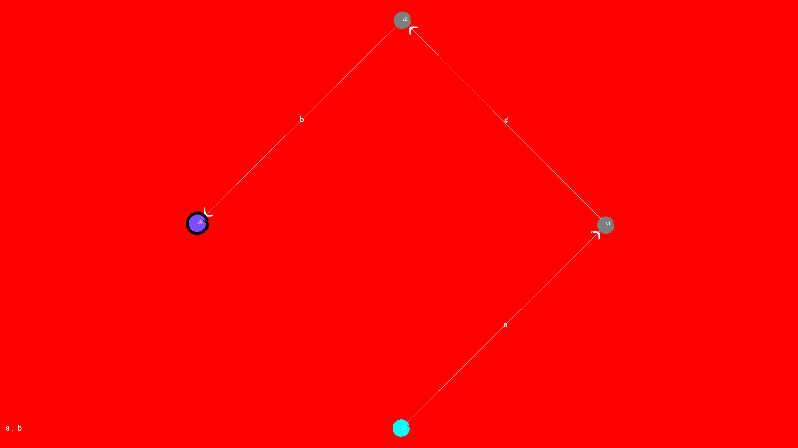

# RegextoNFA
Converting Regular Expressions to Non-deterministic Finite Automaton(NFA) using C++ and displaying the NFA using OpenGL


## Install the following packages

```
libgl1-mesa-dev
freeglut3
freeglut3-dev
```

## Execution

```
g++ polygon.cpp -lGL -lGLU -lglut
./a.out
```


## Example

```
Enter the regular expression:  a.b

state	a	b	î
->0	{1}	-	-
 1	-	-	{2}
 2	-	{3}	-
* 3	-	-	-
total no of sides : 4
a.b
```


[]