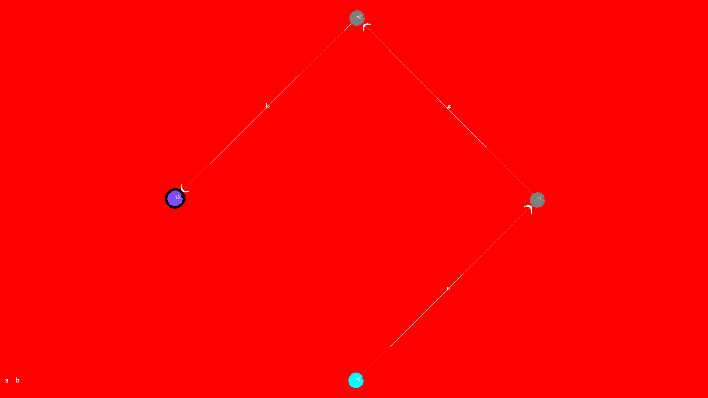
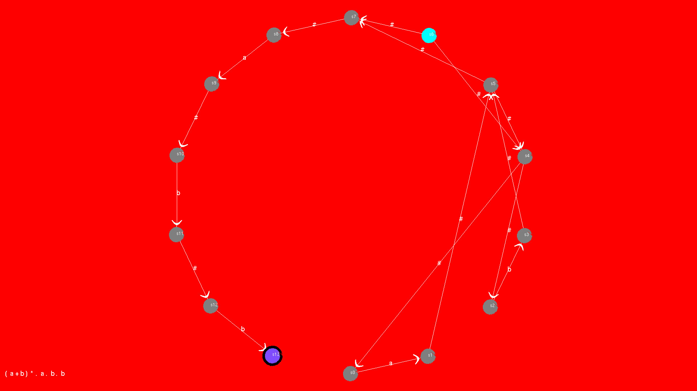

# RegextoNFA
Converting Regular Expressions to Non-deterministic Finite Automaton(NFA) using C++ and displaying the NFA using OpenGL


## Install the following packages

```
libgl1-mesa-dev
freeglut3
freeglut3-dev
```

## Execution

```
g++ polygon.cpp -lGL -lGLU -lglut
./a.out
```


## Example 1

```
Enter the regular expression:  a.b

state	a	b	î
->0	{1}	-	-
 1	-	-	{2}
 2	-	{3}	-
* 3	-	-	-
total no of sides : 4
a.b
```





## Example 2

```
Enter the regular expression: (a+b)*.a.b.b

state	a	b	î
 0	{1}	-	-
 1	-	-	{5}
 2	-	{3}	-
 3	-	-	{5}
 4	-	-	{0,2}
 5	-	-	{4,7}
->6	-	-	{4,7}
 7	-	-	{8}
 8	{9}	-	-
 9	-	-	{10}
 10	-	{11}	-
 11	-	-	{12}
 12	-	{13}	-
* 13	-	-	-
total no of sides : 14
(a+b)*.a.b.b
```

